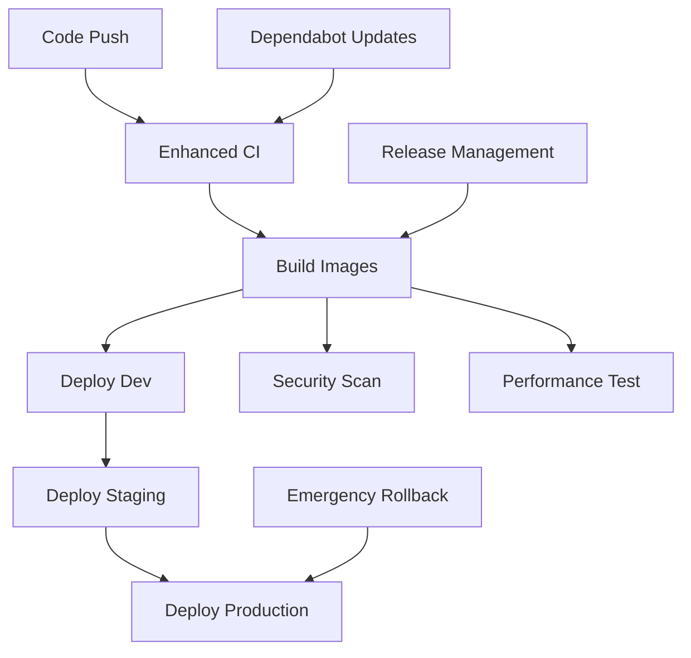

# CI/CD Pipeline Documentation

## Overview

This document provides a comprehensive overview of the CI/CD (Continuous Integration/Continuous Deployment) pipeline implemented for the Insurance Lead Generation AI platform. The pipeline is designed to ensure high-quality code delivery with automated testing, security scanning, and deployment across multiple environments.

## Pipeline Architecture

### Workflow Overview

The CI/CD pipeline consists of 10 interconnected GitHub Actions workflows that handle different aspects of the software delivery lifecycle:

### Core Workflows

#### 1. Enhanced CI Workflow (`.github/workflows/ci.yml`)

**Purpose**: Primary validation pipeline that runs on every code change.

**Triggers**:
- Push to `main` or `develop` branches
- Pull requests targeting `main` or `develop`
- Manual workflow dispatch

**Stages**:
- **Lint & Validation**: ESLint, TypeScript type checking, Prettier formatting
- **Security Scanning**: npm audit, Snyk vulnerability scan, CodeQL analysis, secret scanning
- **Test Suite**: Unit tests with coverage, integration tests, multi-Node.js version testing
- **Build**: TypeScript compilation, artifact storage, build size analysis

**Parallelization**: Lint, Security, and Test stages run in parallel for efficiency.

**Output**: Detailed job summary with pass/fail status and performance metrics.

#### 2. Build Images Workflow (`.github/workflows/build-images.yml`)

**Purpose**: Automated Docker image building and registry deployment.

**Triggers**:
- Successful completion of Enhanced CI workflow
- Manual workflow dispatch

**Features**:
- **Multi-platform builds**: AMD64 and ARM64 architectures
- **Parallel service builds**: API, Backend, Data Service, Orchestrator, Frontend
- **Advanced tagging**: SHA tags, branch tags, semantic versions, timestamps
- **Security scanning**: Trivy vulnerability scanning on all built images
- **Registry push**: AWS ECR with automated login and retry logic

**Image Strategy**:
- `latest` tag for main branch deployments
- `staging` tag for develop branch deployments
- Semantic version tags for releases
- Git SHA tags for traceability
- Timestamp tags for quick reference

#### 3. Development Deployment (`.github/workflows/deploy-dev.yml`)

**Purpose**: Automated deployment to development environment.

**Triggers**:
- Push to main branch
- Successful build-images completion
- Manual workflow dispatch with rollback option

**Deployment Process**:
1. **Pre-deployment Validation**: Prerequisites check, secrets validation
2. **Security Check**: Pre-deployment security scan, secrets verification
3. **Infrastructure Check**: Cluster health, resource availability, manifest validation
4. **Database Migration**: Schema updates, connection validation
5. **Service Deployment**: Kubernetes deployment with health check verification
6. **Post-deployment Tests**: Health checks, smoke tests, performance baseline

**Rollback Capability**: Automatic rollback on health check failures with manual override option.

#### 4. Staging Deployment (`.github/workflows/deploy-staging.yml`)

**Purpose**: Production-like environment deployment with approval gates.

**Triggers**: Manual workflow dispatch with version and strategy selection

**Key Features**:
- **Approval Process**: Maintainer approval required before deployment
- **Blue-Green & Canary Strategies**: Choice between deployment strategies
- **Comprehensive Testing**: Performance benchmarks, monitoring verification
- **Database Preparation**: Backup creation, migration execution
- **Canary Monitoring**: 30-minute monitoring period with automatic rollback triggers

**Safety Measures**:
- Environment backup before deployment
- Traffic switching with health verification
- Rollback triggers on error rate >1% or latency >2s

#### 5. Production Deployment (`.github/workflows/deploy-prod.yml`)

**Purpose**: Production deployment with maximum safety and monitoring.

**Triggers**: Manual dispatch on release tags (v*.*.*) with explicit approval

**Two-Level Approval**:
1. **Tech Lead Approval**: Technical review and validation
2. **Product Approval**: Business impact assessment and sign-off

**Deployment Strategies**:
- **Canary Deployment**: 10% → 50% → 100% traffic shifting
- **Blue-Green Deployment**: Zero-downtime with instant rollback capability

**Production Safety**:
- Strict rollback triggers (error rate >0.5%, latency >1s)
- 30-minute post-deployment monitoring
- Comprehensive health checks and performance validation
- Automatic rollback on threshold violations

#### 6. Release Management (`.github/workflows/release.yml`)

**Purpose**: Automated semantic versioning and release creation.

**Features**:
- **Version Analysis**: Automatic version bump determination from commits
- **Changelog Generation**: Structured changelog from commit messages
- **Git Tag Creation**: Annotated tags with release notes
- **GitHub Release**: Automated release creation with artifacts
- **Deployment Triggering**: Automatic build-images workflow trigger

**Version Strategy**:
- Patch (x.x.X): Bug fixes and minor updates
- Minor (x.X.x): New features, backward compatible
- Major (X.x.x): Breaking changes
- Prerelease: Alpha, beta, release candidate versions

#### 7. Emergency Rollback (`.github/workflows/rollback.yml`)

**Purpose**: Immediate rollback capability for production incidents.

**Capabilities**:
- **Environment Targeting**: Dev, staging, or production rollback
- **Version Selection**: Rollback to specific Git SHA or tag
- **Safety Validation**: Impact assessment, version verification
- **Automated Rollback**: Execution with health verification
- **Incident Reporting**: Automatic rollback report generation

**Rollback Triggers**:
- Manual emergency rollback
- Automatic rollback from failed deployments
- Health check failures during monitoring

#### 8. Security Scanning (`.github/workflows/security-scan.yml`)

**Purpose**: Comprehensive security assessment across the entire stack.

**Scan Types**:
- **Dependency Scanning**: npm audit, Snyk vulnerability detection
- **Container Scanning**: Trivy image scanning, Dockerfile linting
- **Infrastructure Scanning**: Checkov IaC security, KICS configuration analysis
- **Secret Scanning**: TruffleHog, GitHub native secret detection
- **SAST**: CodeQL analysis, Semgrep security rules

**Compliance**: Integration with GitHub Security tab, SARIF report upload.

#### 9. Performance Testing (`.github/workflows/performance.yml`)

**Purpose**: Automated performance validation and regression detection.

**Test Types**:
- **Load Testing**: k6-based load tests with configurable user loads
- **Stress Testing**: System behavior under extreme load conditions
- **Baseline Comparison**: Performance regression detection
- **Threshold Validation**: Automatic failure on performance degradation

**Integration**: Blocks PR merges if performance degrades >10%.

#### 10. Dependabot Updates (`.github/workflows/dependabot.yml`)

**Purpose**: Automated dependency management and security updates.

**Features**:
- **Auto-merge**: Patch and minor updates with security fixes
- **Manual Review**: Major version updates requiring approval
- **Security Alerts**: Weekly security vulnerability reports
- **Branch Cleanup**: Automatic cleanup of merged dependabot branches

## Environment Strategy

### Environment Hierarchy

1. **Development** (`dev`): 
   - Purpose: Developer testing and integration
   - Deployment: Automatic on main branch push
   - Resources: Minimal (1 replica per service)
   - Safety: Low (fast iteration priority)

2. **Staging** (`staging`):
   - Purpose: Production-like testing and validation
   - Deployment: Manual with approval
   - Resources: Medium (2 replicas per service)
   - Safety: Medium (blue-green/canary strategies)

3. **Production** (`prod`):
   - Purpose: Live customer environment
   - Deployment: Manual with dual approval
   - Resources: High (3+ replicas per service)
   - Safety: Maximum (comprehensive monitoring and rollback)

### Deployment Strategies

#### Blue-Green Deployment
- Maintains two identical environments (blue and green)
- Zero-downtime deployment with instant rollback
- Traffic switching via load balancer configuration
- Ideal for: High-availability requirements, database schema changes

#### Canary Deployment
- Gradual traffic shifting (10% → 50% → 100%)
- Real-time monitoring and automatic rollback
- Risk mitigation through progressive exposure
- Ideal for: Performance-sensitive applications, user-facing features

#### Rolling Update
- Gradual replacement of instances within same environment
- Minimal resource overhead
- Suitable for: Internal services, low-risk changes

## Monitoring and Observability

### Pipeline Monitoring
- **Build Success Rate**: Target >95%
- **Deployment Frequency**: Daily for dev, weekly for staging, on-demand for prod
- **Lead Time for Changes**: <1 day for dev, <1 week for production
- **Mean Time to Recovery**: <15 minutes for production incidents

### Application Monitoring
- **Service Health**: Continuous health check monitoring
- **Performance Metrics**: Response time, throughput, error rates
- **Resource Utilization**: CPU, memory, disk, network usage
- **Business Metrics**: Lead conversion rates, user engagement

### Alerting Strategy
- **Critical**: Production outages, security breaches
- **Warning**: Performance degradation, error rate increase
- **Info**: Deployment completions, system maintenance

## Security Integration

### Security Scanning Gates
- **Pre-merge**: All security scans must pass
- **Pre-deploy**: Vulnerability scan required
- **Runtime**: Continuous security monitoring

### Secret Management
- **GitHub Secrets**: Encrypted storage for sensitive data
- **Kubernetes Secrets**: Environment-specific secret management
- **Rotation**: Automated secret rotation policies

### Compliance
- **Audit Logging**: Comprehensive deployment audit trail
- **Access Control**: Role-based access to deployment workflows
- **Change Management**: Approval workflows for production changes

## Performance Optimization

### Build Optimization
- **Caching**: Dependency caching across workflows
- **Parallelization**: Concurrent job execution
- **Artifact Management**: Efficient build artifact storage and retrieval

### Deployment Optimization
- **Resource Planning**: Right-sized deployments per environment
- **Network Optimization**: CDN integration, compression
- **Database Optimization**: Connection pooling, query optimization

## Cost Management

### Resource Optimization
- **Auto-scaling**: Dynamic resource allocation based on demand
- **Reserved Instances**: Cost optimization for predictable workloads
- **Monitoring**: Continuous cost tracking and optimization

### Pipeline Efficiency
- **Build Time Optimization**: Target <15 minutes for complete pipeline
- **Deployment Time**: <10 minutes for dev, <20 minutes for production
- **Resource Utilization**: Efficient workflow resource allocation

## Integration Points

### External Services
- **AWS Services**: ECR, EKS, CloudWatch, CodeDeploy
- **Monitoring**: Prometheus, Grafana, AlertManager
- **Communication**: Slack, email, PagerDuty integration
- **Security**: Snyk, Trivy, CodeQL integration

### Development Tools
- **Version Control**: Git with conventional commits
- **Package Management**: pnpm with workspace support
- **Testing**: Jest, pytest for comprehensive test coverage
- **Code Quality**: ESLint, Prettier, TypeScript

## Troubleshooting Guide

### Common Issues
1. **Build Failures**: Check dependency versions, TypeScript errors
2. **Deployment Failures**: Verify Kubernetes connectivity, resource availability
3. **Security Scan Failures**: Address vulnerabilities, update dependencies
4. **Performance Regressions**: Analyze performance test results, optimize code

### Debug Workflows
- **Enable Debug Mode**: Add `debug: true` to workflow inputs
- **Verbose Logging**: Enable detailed logs in deployment scripts
- **Manual Verification**: Use health check scripts for debugging
- **Rollback Procedures**: Follow documented rollback processes

## Continuous Improvement

### Metrics Review
- **Monthly**: Pipeline performance metrics review
- **Quarterly**: Deployment strategy effectiveness assessment
- **Annually**: Complete CI/CD pipeline architecture review

### Enhancement Process
- **Feedback Collection**: Team feedback on pipeline usability
- **Automation Opportunities**: Identify manual processes for automation
- **Security Updates**: Regular security tool updates and improvements
- **Performance Optimization**: Continuous optimization based on metrics

## Conclusion

This CI/CD pipeline provides a robust, secure, and efficient delivery mechanism for the Insurance Lead Generation AI platform. The multi-stage validation, comprehensive monitoring, and automated rollback capabilities ensure reliable deployments while maintaining high security and performance standards.

The pipeline architecture supports rapid development cycles while providing the safety nets necessary for production deployments. Regular review and optimization of the pipeline processes ensure continued effectiveness and alignment with business objectives.