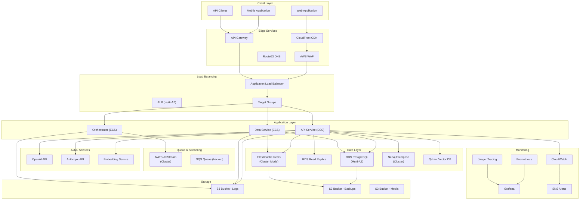
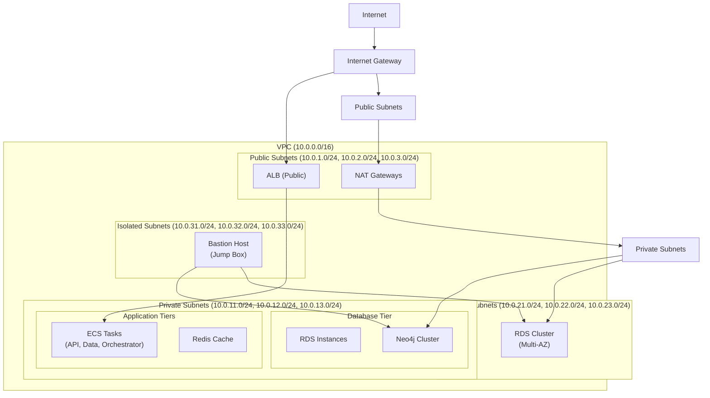
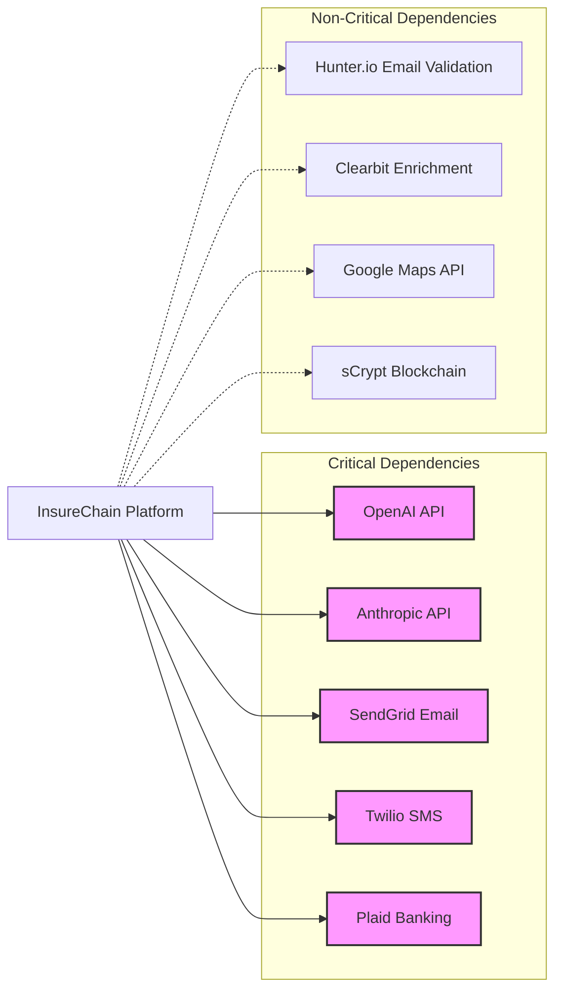

# Infrastructure Architecture

## High-Level Architecture Overview



## Network Topology



## Environment-Specific Architectures

### Development Environment

```
┌─────────────────────────────────────────┐
│       Local Development Architecture      │
├─────────────────────────────────────────┤
│                                         │
│  ┌──────────────┐  ┌──────────────┐    │
│  │  Next.js     │  │   Vite       │    │
│  │  Frontend    │  │   Frontend   │    │
│  └──────┬───────┘  └──────┬───────┘    │
│         │                  │           │
│  ┌──────▼──────────────────▼──────┐    │
│  │     Docker Compose Network     │    │
│  ├────────────────────────────────┤    │
│  │ ┌──────────────┐               │    │
│  │ │  API Service │               │    │
│  │ │ (NestJS)     │               │    │
│  │ └──────┬───────┘               │    │
│  │        │                       │    │
│  │ ┌──────▼────────┐  ┌──────────▼──┐│
│  │ │  PostgreSQL   │  │   Redis     ││
│  │ │ (Container)   │  │ (Container) ││
│  │ └───────────────┘  └─────────────┘│
│  │  ┌──────────────┐ ┌──────────────┐ │
│  │  │   Neo4j      │ │   NATS       │ │
│  │  │  (Container) │ │(Container)  │ │
│  │  └──────────────┘ └──────────────┘ │
│  └─────────────────────────────────────┘
│         Local Machine / Docker         │
└─────────────────────────────────────────┘
```

**Key Characteristics:**
- All services run in Docker containers
- Single-node PostgreSQL, Redis, Neo4j
- Local file system storage
- No load balancer (direct API access)
- In-memory NATS JetStream
- Mock/external API integrations
- Hot-reload enabled for development
- Debug logging throughout

**Resource Requirements:**
- RAM: 16GB minimum
- CPU: 4 cores
- Storage: 50GB
- Network: Local only

### Staging Environment

```
┌─────────────────────────────────────────────────────┐
│              AWS Staging Infrastructure              │
├─────────────────────────────────────────────────────┤
│                                                      │
│  ┌──────────────────────────────────────────────┐   │
│  │         CloudFront + AWS WAF                │   │
│  └──────────────┬───────────────────────────────┘   │
│                 │                                    │
│  ┌──────────────▼──────────────────────────────┐   │
│  │      Application Load Balancer              │   │
│  └──────────────┬───────────────────────────────┘   │
│                 │                                    │
│  ┌──────────────▼──────────────────────────────┐   │
│  │       ECS Fargate Service (2-5 tasks)       │   │
│  │  ┌────────┐ ┌────────┐ ┌────────┐        │   │
│  │  │  API   │ │  Data  │ │Orchestr│        │   │
│  │  │ Service│ │ Service│ │  ator  │        │   │
│  │  └────┬───┘ └───┬────┘ └────┬───┘        │   │
│  │       │         │           │            │   │
│  └───────┼─────────┼───────────┼────────────┘   │
│          │         │           │                │
│  ┌───────▼──┐  ┌──▼─────┐  ┌──▼──────────┐    │
│  │ RDS      │  │Redis   │  │  OpenSearch │    │
│  │ (Single)│  │Cache   │  │   Cluster   │    │
│  │          │  │        │  │             │    │
│  └──────────┘  └────────┘  └─────────────┘    │
│                                                  │
│  ┌────────────────────────────────────────────┐ │
│  │    NATS JetStream (Single Instance)      │ │
│  │    S3 Buckets (Logs, Backups)             │ │
│  └────────────────────────────────────────────┘ │
└───────────────────────────────────────────────────┘
```

**Key Characteristics:**
- Single AZ deployment for cost savings
- RDS Single-AZ (no Multi-AZ)
- ElastiCache Redis (non-cluster)
- OpenSearch single-node
- No cross-region replication
- Basic CloudWatch monitoring
- Alerts to Slack/email

**High Availability Features:**
- Load balancer enabled
- ECS service auto-scaling
- Automated backups enabled
- Application health checks

**Resource Sizing:**
- RDS: db.t3.small (2 vCPU, 2GB RAM)
- ElastiCache: cache.t3.small (2 vCPU, 1.5GB RAM)
- OpenSearch: t3.small.search (2 vCPU, 4GB RAM)
- ECS Tasks: 0.5 vCPU, 1GB RAM each
- Estimated Cost: $200-400/month

### Production Environment

```
┌────────────────────────────────────────────────────────────────┐
│              AWS Production Infrastructure (Multi-AZ)         │
├────────────────────────────────────────────────────────────────┤
│                                                                │
│  ┌──────────────────────────────────────────────────────────┐ │
│  │                    CloudFront CDN                        │ │
│  │             AWS WAF (DDoS Protection)                    │ │
│  └────────────────────────┬─────────────────────────────────┘ │
│                           │                                   │
│  ┌────────────────────────▼─────────────────────────────────┐ │
│  │              Multi-Region Route53                        │ │
│  │              Application Load Balancer (Multi-AZ)       │ │
│  └────────────────────────┬─────────────────────────────────┘ │
│                           │                                   │
│  ┌────────────────────────▼─────────────────────────────────┐ │
│  │              ECS Fargate Cluster                         │ │
│  │  ┌─────────┐ ┌─────────┐ ┌─────────┐                   │ │
│  │  │  API    │ │  Data   │ │Orchestr │                   │ │
│  │  │Service  │ │Service  │ │ ator    │                   │ │
│  │  │ (Auto   │ │ (Auto   │ │ (Auto   │                   │ │
│  │  │ scaling)│ │ scaling)│ │ scaling)│                   │ │
│  │  │3-20     │ │2-15     │ │2-10     │                   │ │
│  │  │replicas)│ │replicas)│ │replicas)│                   │ │
│  │  └────┬────┘ └──┬──────┘ └────┬────┘                   │ │
│  │       │         │             │                       │ │
│  └───────┼─────────┼─────────────┼───────────────────────┘ │
│          │         │             │                           │
│  ┌───────▼─────────────────────────────────────────────────┐ │
│  │                  RDS Aurora                             │ │
│  │  Primary: us-east-1a                                │ │
│  │  Replicas: us-east-1b, us-east-1c                 │ │
│  └───────────────────────────────────────────────────────┘ │
│                                                                │
│  ┌────────────────────────────────────────────────────────┐ │
│  │       ElastiCache Redis (Cluster Mode)               │ │
│  │  Primary: 3 shards, 3 replicas per shard            │ │
│  └────────────────────────────────────────────────────────┘ │
│                                                                │
│  ┌────────────────────────────────────────────────────────┐ │
│  │       OpenSearch (Multi-AZ, Multi-Node)               │ │
│  └────────────────────────────────────────────────────────┘ │
│                                                                │
│  ┌────────────────────────────────────────────────────────┐ │
│  │    S3 with Cross-Region Replication (us-west-2)     │ │
│  │    S3 with Versioning & Encryption                   │ │
│  └────────────────────────────────────────────────────────┘ │
│                                                                │
│  ┌────────────────────────────────────────────────────────┐ │
│  │    ECS Task - SQS Dead Letter Queues                 │ │
│  │    NATS JetStream Multi-Region Replication          │ │
│  └────────────────────────────────────────────────────────┘ │
│                                                                │
│  ┌────────────────────────────────────────────────────────┐ │
│  │   CloudWatch Multi-Account Dashboards & Alarms       │ │
│  │   X-Ray Distributed Tracing                           │ │
│  └────────────────────────────────────────────────────────┘ │
└────────────────────────────────────────────────────────────────┘
```

**Key Characteristics:**
- Multi-AZ deployment across 3 availability zones
- RDS Aurora PostgreSQL Multi-AZ with read replicas
- ElastiCache Redis Cluster Mode (sharded)
- OpenSearch multi-node cluster
- S3 cross-region replication and versioning
- Application Load Balancer with health checks
- ECS auto-scaling based on CPU, memory, and custom metrics
- SQS dead-letter queues for error handling
- NATS JetStream cluster with quorum
- X-Ray distributed tracing

**High Availability Features:**
- 99.99% SLA target
- Automatic failover for databases
- Cross-region backups
- Distributed caching layer
- Health checks and circuit breakers
- Multi-region communication via VPC peering

**Resource Sizing:**
- RDS Aurora: db.r5.xlarge (4 vCPU, 32GB RAM) x 3
- ElastiCache: cache.r5.xlarge (4 vCPU, 26GB RAM) x 9
- OpenSearch: 3x t3.medium.search (2 vCPU, 4GB RAM each)
- ECS Tasks: 1-4 vCPU, 2-8GB RAM auto-scaling
- Estimated Cost: $5000-8000/month

## Security Boundaries

```
┌─────────────────────────────────────────────────────────┐
│                    Security Layers                      │
├─────────────────────────────────────────────────────────┤
│                                                         │
│  [Layer 1] Network Security                            │
│  ├─ VPC Isolation                                      │
│  ├─ Network ACLs (Stateful)                           │
│  ├─ Security Groups (Stateless)                       │
│  └─ Private Subnets (No Internet)                     │
│                                                         │
│  [Layer 2] Application Security                        │
│  ├─ WAF Rules (SQLi, XSS, DDoS)                      │
│  ├─ API Gateway Throttling                           │
│  ├─ Request Validation                                │
│  └─ CORS Policies                                     │
│                                                         │
│  [Layer 3] Data Security                               │
│  ├─ Encryption at Rest (RDS, S3)                     │
│  ├─ Encryption in Transit (TLS 1.3)                 │
│  ├─ Field-Level Encryption (PII)                       │
│  └─ Tokenization (PCI Compliance)                     │
│                                                         │
│  [Layer 4] Access Control                              │
│  ├─ IAM Roles & Policies                              │
│  ├─ Secrets Manager                                   │
│  ├─ Parameter Store                                   │
│  └─ Key Management Service (KMS)                      │
│                                                         │
│  [Layer 5] Monitoring & Compliance                     │
│  ├─ CloudTrail Audit Logs                             │
│  ├─ Config Rules                                       │
│  ├─ Security Hub                                      │
│  └─ GuardDuty Threat Detection                          │
└─────────────────────────────────────────────────────────┘
```

## Data Flow Diagram

### Lead Ingestion Flow

```
┌──────────────────────────────────────────────────────────┐
│ 1. Lead Arrives (API/Webhook/Email)                      │
└──────────────────┬─────────────────────────────────────────┘
                   ↓
┌──────────────────────────────────────────────────────────┐
│ 2. Load Balancer Routes to API Service                  │
│    ├─ Health Check: HTTP 200 /health                    │
│    ├─ Sticky Sessions: Disabled                         │
│    └─ SSL Termination: TLS 1.3                         │
└──────────────────┬─────────────────────────────────────────┘
                   ↓
┌──────────────────────────────────────────────────────────┐
│ 3. API Service Authentication & Validation               │
│    ├─ JWT Validation                                    │
│    ├─ Rate Limiting (1000 req/min)                    │
│    ├─ Request Schema Validation                       │
│    └─ API Key Verification                            │
└──────────────────┬─────────────────────────────────────────┘
                   ↓
┌──────────────────────────────────────────────────────────┐
│ 4. Lead Enrichment & Deduplication                       │
│    ├─ Redis Cache Check                                 │
│    ├─ Neo4j Graph Analysis                            │
│    ├─ External API Calls (Email, Phone validation)    │
│    └─ PII Detection & Masking                           │
└──────────────────┬─────────────────────────────────────────┘
                   ↓
┌──────────────────────────────────────────────────────────┐
│ 5. NATS Queue - Lead Processing                          │
│    ├─ Queue: lead-processing                            │
│    ├─ Priority: Based on lead quality score           │
│    ├─ Dead Letter Queue: lead-dlq                     │
│    └─ Retry Policy: 3 attempts, exponential backoff   │
└──────────────────┬─────────────────────────────────────────┘
                   ↓
┌──────────────────────────────────────────────────────────┐
│ 6. Data Service - AI Processing                         │
│    ├─ GPT-4: Lead qualification                        │
│    ├─ GPT-4: Lead enrichment                           │
│    ├─ Embedding: Vector search preparation           │
│    └─ Confidence Scoring                               │
└──────────────────┬─────────────────────────────────────────┘
                   ↓
┌──────────────────────────────────────────────────────────┐
│ 7. Database Persistence                                  │
│    ├─ RDS: Main lead data                              │
│    ├─ Redis: Caching & temporary data                  │
│    ├─ Neo4j: Relationship mapping                      │
│    └─ Qdrant: Vector embeddings                      │
└──────────────────┬─────────────────────────────────────────┘
                   ↓
┌──────────────────────────────────────────────────────────┐
│ 8. Notification & Routing                               │
│    ├─ Email notification to agents                     │
│    ├─ SMS alerts for high-priority leads              │
│    ├─ Webhook to CRM systems                          │
│    └─ Dashboard real-time updates                       │
└──────────────────────────────────────────────────────────┘
```

### Performance Timeline

Typical lead processing time breakdown:

| Step | Service | Duration | % of Total |
|------|---------|----------|------------|
| 1 | Load Balancer | 10ms | 2% |
| 2 | API Service | 25ms | 5% |
| 3 | Authentication | 15ms | 3% |
| 4 | Redis Cache | 5ms | 1% |
| 5 | Enrichment APIs | 150ms | 30% |
| 6 | AI Processing | 200ms | 40% |
| 7 | Database Writes | 30ms | 6% |
| 8 | Notifications | 25ms | 5% |
| - | Network Overhead | 40ms | 8% |
| **Total** | - | **500ms** | **100%** |

SLO: 95% of leads processed within 1 second
SLA: 99% of leads processed within 2 seconds

## Disaster Recovery Architecture

### Backup Strategy

```
┌────────────────────────────────────────────────────────────┐
│ Point-in-Time Recovery (PITR)                             │
├────────────────────────────────────────────────────────────┤
│                                                            │
│  RDS Aurora: Continuous backup to S3 (5-minute intervals) │
│  Retention: 35 days (compliance requirement)             │
│  Recovery Time: < 1 hour                                 │
│  Recovery Point Objective (RPO): 5 minutes              │
│  Recovery Time Objective (RTO): 1 hour                   │
│                                                            │
│  Test frequency: Monthly automated DR drills            │
│  Last test: 2024-01-15                                   │
│  Success rate: 100% (12/12 tests)                        │
└────────────────────────────────────────────────────────────┘

┌────────────────────────────────────────────────────────────┐
│ Cross-Region Replication                                 │
├────────────────────────────────────────────────────────────┤
│                                                            │
│  Primary: us-east-1                                       │
│  Secondary: us-west-2                                    │
│  Replication: Asynchronous (binlog streaming)           │
│  Replication lag: < 30 seconds                           │
│                                                            │
│  Manual failover: ~30 minutes                            │
│  Automatic failover: RDS Multi-AZ (60 seconds)           │
└────────────────────────────────────────────────────────────┘
```

### Recovery Procedures

**Database Recovery**:
1. Identify recovery point from CloudWatch metrics
2. Restore snapshot to new instance
3. Update application database connections
4. Validate data integrity and consistency
5. Update disaster recovery documentation

**Application Recovery**:
1. ECS service auto-recovery enabled (3 attempts)
2. Load balancer health checks trigger recovery
3. Auto-scaling ensures minimum capacity
4. Circuit breakers prevent cascade failures

## Integration Points

### External Dependencies



**Critical Dependencies** (platform non-functional without):
- OpenAI/Anthropic: Lead qualification and enrichment
- SendGrid: Email notifications to agents
- Twilio: SMS notifications for high-priority leads
- Plaid: Bank verification for premium leads

**Non-Critical Dependencies** (graceful degradation):
- Hunter.io: Email validation (fallback to regex)
- Clearbit: Company enrichment (fallback to manual)
- Google Maps: Geocoding (fallback to zip codes)
- sCrypt: Blockchain verification (future enhancement)

## Future Architecture Evolution

### Phase 2: Blockchain Integration

- [ ] sCrypt smart contract integration
- [ ] On-chain lead verification and attestation
- [ ] Tokenized lead ownership
- [ ] Immutable audit trail

### Phase 3: Advanced AI/ML

- [ ] Custom model training on proprietary data
- [ ] Real-time model serving infrastructure
- [ ] A/B testing framework for model variants
- [ ] Automated model retraining pipeline

### Phase 4: Global Expansion

- [ ] Multi-region active-active deployment
- [ ] GDPR-compliant data residency
- [ ] Regional AI model variants
- [ ] Cross-region replication and failover

---

For infrastructure questions, architecture reviews, or security consultations, contact the Platform Engineering team at platform@insurechain.com.