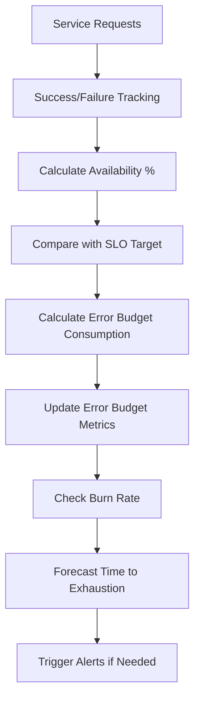
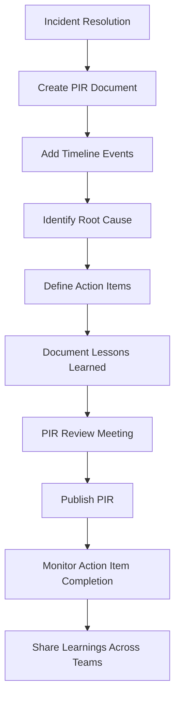
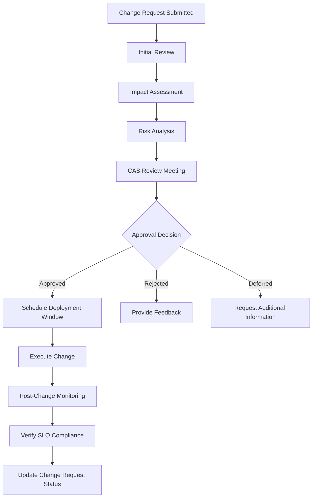

# Phase 14.6: SLOs, Error Budgets & Runbooks

## 🎯 Overview

This phase implements comprehensive Service Level Objectives (SLOs), Error Budget management, and operational runbooks for the Insurance Lead Gen platform. These capabilities provide the foundation for reliable, measurable service delivery and systematic incident response.

## 📋 Table of Contents

1. [Service Level Objectives (SLOs)](#service-level-objectives-slos)
2. [Error Budget Management](#error-budget-management)
3. [Runbooks & Procedures](#runbooks--procedures)
4. [Post-Incident Reviews](#post-incident-reviews)
5. [Change Management](#change-management)
6. [Compliance & Auditing](#compliance--auditing)
7. [Implementation Details](#implementation-details)
8. [Integration Guide](#integration-guide)
9. [Monitoring & Alerting](#monitoring--alerting)
10. [Best Practices](#best-practices)

## Service Level Objectives (SLOs)

### SLO Definitions

The platform defines comprehensive SLOs across four key dimensions:

#### 1. Availability SLOs

- **API Service**: 99.9% availability over 28-day window
- **Data Service**: 99.95% availability over 28-day window  
- **Orchestrator Service**: 99.9% availability over 28-day window
- **Database**: 99.99% availability over 28-day window

#### 2. Latency SLOs

| Service | Metric | Target | Window |
|---------|--------|--------|--------|
| API Service | P95 Latency | 500ms | 7 days |
| API Service | P99 Latency | 1000ms | 7 days |
| Data Service | P95 Latency | 300ms | 7 days |
| Orchestrator | P95 Latency | 800ms | 7 days |
| AI Models | P95 Latency | 2000ms | 7 days |
| Database | P95 Query Latency | 100ms | 7 days |

#### 3. Throughput SLOs

- **API Service**: 100 requests/second sustained throughput
- **Data Service**: 50 requests/second sustained throughput  
- **Orchestrator**: 20 leads/second processing capacity

#### 4. Correctness SLOs

- **API Service**: 99.9% error-free requests
- **Data Service**: 99.95% error-free requests
- **Lead Processing**: 99.9% successful processing rate
- **AI Models**: 99.5% success rate

### SLO Calculation Methodology

```typescript
// Availability Calculation
availabilityPercentage = (successfulRequests / totalRequests) * 100

// Error Budget Calculation
errorBudgetMinutes = windowInDays * 24 * 60 * (1 - (targetAvailability / 100))

// Example: 99.9% over 28 days
errorBudgetMinutes = 28 * 24 * 60 * (1 - 0.999) = 403.2 minutes
```

### SLO Tracking Metrics

The system exposes these Prometheus metrics:

- `slo_availability_percentage` - Current SLO compliance percentage
- `slo_error_budget_remaining` - Remaining error budget percentage
- `slo_error_budget_burn_rate` - Current burn rate
- `slo_violations_total` - Total SLO violations by severity
- `slo_latency_seconds` - Latency measurements for SLO tracking

## Error Budget Management

### Error Budget Policy

| Remaining Budget | Action Required | Approval Needed |
|------------------|-----------------|------------------|
| > 50% | Monitor | None |
| 30-50% | Optimize | Team Lead |
| 10-30% | Mitigate | Engineering Manager |
| < 10% | Feature Freeze | CTO |

### Error Budget Consumption Tracking



### Error Budget Forecasting

The system provides 24-hour and 7-day forecasts:

```bash
# 24-hour forecast
forecast_24h = remaining_budget - (burn_rate * 1440)

# 7-day forecast  
forecast_7d = remaining_budget - (burn_rate * 10080)
```

## Runbooks & Procedures

### Top 10 Incident Runbooks

1. **SLO Violation Response**
2. **Error Budget Depletion**
3. **High Error Budget Burn Rate**
4. **API Service Latency Violation**
5. **Database Connection Pool Exhaustion**
6. **AI Model Failure**
7. **Lead Processing Queue Overflow**
8. **Change Management Rollback**
9. **Compliance Audit Failure**
10. **SLO Reset Procedure**

### Runbook Structure

```yaml
runbook:
  id: "slo-violation"
  title: "SLO Violation Response"
  incidentType: "SLO Violation"
  severity: "SEV-2"
  steps:
    - step: 1
      title: "Acknowledge Alert"
      description: "Notify SRE team via #sre-oncall"
    - step: 2
      title: "Assess Impact"
      description: "Check service health and metrics"
      commands:
        - "kubectl get pods -n production -o wide"
        - "kubectl get events -n production --sort-by='.lastTimestamp'"
    - step: 3
      title: "Check SLO Metrics"
      description: "Verify current SLO compliance"
      commands:
        - "curl -s http://localhost:9090/api/v1/query?query=slo_availability_percentage"
    - step: 4
      title: "Implement Mitigation"
      description: "Apply appropriate mitigation strategies"
      decisionPoints:
        - condition: "High CPU usage"
          action: "Scale up service"
          nextStep: 5
        - condition: "Database issues"
          action: "Check database health"
          nextStep: 6
```

## Post-Incident Reviews

### PIR Process Flow



### PIR Template

```markdown
# Post-Incident Review: [Incident Title]

## Basic Information
- **Incident ID**: INC-2023-001
- **Severity**: SEV-2
- **Start Time**: 2023-12-14 14:30:00 UTC
- **End Time**: 2023-12-14 15:45:00 UTC
- **Duration**: 1 hour 15 minutes
- **Impact**: 45 minutes of degraded API performance

## Timeline

| Time | Event | Type | Responsible |
|------|-------|------|-------------|
| 14:30 | Alert triggered - HighAPIErrorRate | Detection | Monitoring System |
| 14:35 | SRE team acknowledged incident | Response | John Doe |
| 14:40 | Identified database connection pool exhaustion | Investigation | Jane Smith |
| 14:45 | Increased connection pool size | Mitigation | Database Team |
| 15:00 | Service recovered to normal operation | Resolution | SRE Team |
| 15:45 | Incident declared resolved | Closure | Incident Commander |

## Root Cause Analysis

The incident was caused by database connection pool exhaustion due to:
1. Unexpected spike in lead processing volume (150% of normal)
2. Inefficient connection handling in new AI scoring feature
3. Lack of auto-scaling for connection pool
4. Insufficient monitoring of connection pool metrics

## Impact Assessment

- **Service Impact**: API response times increased from 200ms to 2.5s
- **Business Impact**: 1,245 leads delayed processing
- **Financial Impact**: Estimated $4,500 in lost opportunity
- **Customer Impact**: 42 customer complaints received

## Action Items

| ID | Description | Owner | Due Date | Status | Priority |
|----|-------------|-------|----------|--------|----------|
| AI-2023-001 | Increase database connection pool size from 50 to 100 | Database Team | 2023-12-21 | Completed | High |
| AI-2023-002 | Implement auto-scaling for connection pool | Engineering | 2023-12-28 | In Progress | High |
| AI-2023-003 | Add connection pool monitoring to dashboards | Monitoring Team | 2023-12-18 | Completed | Medium |
| AI-2023-004 | Optimize AI scoring feature connection usage | AI Team | 2024-01-10 | Open | Medium |
| AI-2023-005 | Update runbooks with connection pool troubleshooting | SRE Team | 2023-12-15 | Completed | Low |

## Lessons Learned

1. **Monitoring Gaps**: Need comprehensive monitoring of all resource pools
2. **Auto-scaling**: Critical resources should have auto-scaling capabilities
3. **Capacity Planning**: Better forecasting of load spikes during marketing campaigns
4. **Feature Testing**: New features need load testing with realistic connection patterns
5. **Incident Response**: Faster identification of root cause through better tooling

## Preventive Measures

1. Implement auto-scaling for database connection pools
2. Add connection pool metrics to SLO dashboards
3. Create specific alerts for connection pool exhaustion
4. Update capacity planning models with marketing campaign data
5. Add connection pool testing to CI/CD pipeline

## Follow-up

- **Next Review Date**: 2024-01-15
- **Action Item Completion Target**: 90% by 2024-01-31
- **Lessons Shared With**: Engineering, SRE, Database teams
```

## Change Management

### Change Advisory Board (CAB) Process



### Change Categories & Approval Requirements

| Category | Risk Level | Approval Required | Deployment Window |
|----------|------------|-------------------|-------------------|
| Code | Low | Team Lead | Any time |
| Code | Medium | Engineering Manager | Business hours |
| Code | High | CAB | Maintenance window |
| Config | Low | Team Lead | Any time |
| Config | Medium | Engineering Manager | Business hours |
| Infrastructure | Any | CAB | Maintenance window |
| Data | Any | CAB + Data Governance | Maintenance window |

### Change Impact Assessment Checklist

```markdown
## Change Impact Assessment

### Service Impact
- [ ] Check current SLO compliance status
- [ ] Review error budget consumption
- [ ] Analyze historical performance trends
- [ ] Identify dependent services
- [ ] Assess resource requirements

### Risk Assessment
- [ ] Evaluate failure scenarios
- [ ] Identify rollback procedures
- [ ] Assess data integrity risks
- [ ] Check security implications
- [ ] Review compliance impact

### Testing Requirements
- [ ] Unit test coverage
- [ ] Integration test coverage
- [ ] Performance testing
- [ ] Load testing
- [ ] Failure scenario testing
- [ ] Rollback testing

### Deployment Plan
- [ ] Define deployment window
- [ ] Identify deployment method (rolling, blue-green, canary)
- [ ] Prepare monitoring dashboard
- [ ] Define success criteria
- [ ] Prepare communication plan

### Rollback Plan
- [ ] Document rollback procedure
- [ ] Test rollback procedure
- [ ] Define rollback triggers
- [ ] Identify rollback owners
- [ ] Prepare rollback communication
```

## Compliance & Auditing

### Compliance Framework

The platform implements compliance with these standards:

- **ISO 27001**: Information Security Management
- **SOC 2 Type II**: Security, Availability, Processing Integrity
- **GDPR**: Data Protection and Privacy
- **HIPAA**: Healthcare Data Protection (for health insurance leads)

### Compliance Monitoring

| Requirement | Monitoring Method | Frequency |
|-------------|-------------------|-----------|
| SLO Compliance | Automated metrics collection | Continuous |
| Error Budget Tracking | Real-time monitoring | Continuous |
| Change Management | Audit trail logging | Continuous |
| Incident Response | PIR documentation | Per incident |
| Data Protection | Encryption verification | Daily |
| Access Control | Permission audits | Weekly |

### Audit Trail Implementation

```typescript
// Audit trail structure
auditTrail: {
  timestamp: Date;
  action: string;
  performedBy: string;
  service: string;
  changeType: 'slo_update' | 'error_budget_reset' | 'change_request' | 'incident_response';
  oldValue?: any;
  newValue?: any;
  metadata?: Record<string, any>;
  ipAddress?: string;
  userAgent?: string;
}
```

## Implementation Details

### Core Components

#### 1. SLO Management Service

```typescript
// packages/core/src/monitoring/slos.ts
interface SLODefinition {
  name: string;
  description: string;
  target: number;
  window: string;
  service: string;
  metricType: 'availability' | 'latency' | 'throughput' | 'correctness';
  threshold?: number;
}

function initializeSLOs(): void {
  // Initialize all SLO definitions
  // Set up error budget tracking
  // Register Prometheus metrics
}

function updateSLOMetrics(sloName: string, service: string, successRate: number, latencyMs?: number): void {
  // Update SLO compliance metrics
  // Calculate error budget consumption
  // Check for violations
  // Update Prometheus gauges
}
```

#### 2. Error Budget Tracking

```typescript
interface ErrorBudget {
  sloName: string;
  totalBudget: number;
  consumedBudget: number;
  remainingBudget: number;
  burnRate: number;
  lastUpdated: Date;
}

function calculateTimeToExhaustion(sloName: string, service: string): number {
  // Calculate minutes until error budget exhausted
  // Used for forecasting and alerting
}

function isErrorBudgetDepleted(sloName: string, service: string): boolean {
  // Check if error budget is exhausted
  // Triggers feature freeze procedures
}
```

#### 3. Alerting Integration

```yaml
# monitoring/prometheus/alerts.yml
groups:
  - name: slo_alerts
    rules:
      - alert: SLOViolationCritical
        expr: slo_availability_percentage < 95
        for: 5m
        labels:
          severity: critical
        annotations:
          summary: "Critical SLO violation detected"
          runbook_url: "https://docs.insurance-lead-gen.com/runbooks/slo-violation"

      - alert: ErrorBudgetCritical
        expr: slo_error_budget_remaining < 10
        for: 1m
        labels:
          severity: critical
        annotations:
          runbook_url: "https://docs.insurance-lead-gen.com/runbooks/error-budget-depletion"
```

### Integration Points

#### API Service Integration

```typescript
// apps/api/src/app.ts
import { initializeSLOs, updateSLOMetrics } from '@insurance-lead-gen/core';

// Initialize SLOs on startup
initializeSLOs();

// Update SLO metrics on each request
app.use((req, res, next) => {
  const start = Date.now();
  
  res.on('finish', () => {
    const duration = Date.now() - start;
    const success = res.statusCode < 500;
    
    updateSLOMetrics(
      'api_availability', 
      'api-service',
      success ? 1 : 0,
      duration
    );
  });
  
  next();
});
```

#### Orchestrator Service Integration

```typescript
// apps/orchestrator/src/index.ts
import { updateSLOMetrics } from '@insurance-lead-gen/core';

// Track lead processing SLOs
async function processLead(leadId: string) {
  const start = Date.now();
  
  try {
    const result = await leadProcessingPipeline(leadId);
    
    updateSLOMetrics(
      'lead_processing_success_rate',
      'orchestrator',
      1, // Success
      Date.now() - start
    );
    
    return result;
  } catch (error) {
    updateSLOMetrics(
      'lead_processing_success_rate',
      'orchestrator',
      0, // Failure
      Date.now() - start
    );
    
    throw error;
  }
}
```

## Integration Guide

### Step 1: Initialize SLOs

```typescript
// In your application entry point
import { initializeSLOs } from '@insurance-lead-gen/core';

// Initialize during application startup
initializeSLOs();
```

### Step 2: Update SLO Metrics

```typescript
import { updateSLOMetrics } from '@insurance-lead-gen/core';

// For HTTP endpoints
app.use((req, res, next) => {
  const start = Date.now();
  
  res.on('finish', () => {
    const success = res.statusCode < 500;
    updateSLOMetrics('api_availability', 'api-service', success ? 1 : 0, Date.now() - start);
  });
  
  next();
});

// For background jobs
async function processJob(job: Job) {
  const start = Date.now();
  
  try {
    await job.process();
    updateSLOMetrics('job_success_rate', 'worker-service', 1, Date.now() - start);
  } catch (error) {
    updateSLOMetrics('job_success_rate', 'worker-service', 0, Date.now() - start);
    throw error;
  }
}
```

### Step 3: Monitor SLOs

```bash
# Access SLO dashboard
kubectl port-forward -n monitoring svc/grafana 3000:3000
# Open http://localhost:3000/d/slo-tracking

# Query SLO metrics
curl http://localhost:9090/api/v1/query?query=slo_availability_percentage

# Check error budget status
curl http://localhost:9090/api/v1/query?query=slo_error_budget_remaining
```

### Step 4: Handle Alerts

```bash
# SLO Violation Critical
# Severity: critical
# Runbook: https://docs.insurance-lead-gen.com/runbooks/slo-violation

# Error Budget Critical
# Severity: critical  
# Runbook: https://docs.insurance-lead-gen.com/runbooks/error-budget-depletion

# High Error Budget Burn Rate
# Severity: warning
# Runbook: https://docs.insurance-lead-gen.com/runbooks/high-burn-rate
```

## Monitoring & Alerting

### SLO Tracking Dashboard

The platform includes a comprehensive SLO tracking dashboard with:

- **Overall SLO Compliance**: Aggregate view of all SLOs
- **Error Budget Status**: Remaining budget across all services
- **Burn Rate Monitoring**: Current consumption rates
- **Violation Trends**: Historical violation patterns
- **Forecasting**: Time to error budget exhaustion
- **Service Breakdown**: SLO compliance by service

### Alert Configuration

| Alert | Severity | Threshold | Runbook |
|-------|----------|-----------|---------|
| SLOViolationCritical | Critical | < 95% availability | [SLO Violation](https://docs.insurance-lead-gen.com/runbooks/slo-violation) |
| SLOViolationWarning | Warning | 95-99% availability | [SLO Violation](https://docs.insurance-lead-gen.com/runbooks/slo-violation) |
| ErrorBudgetCritical | Critical | < 10% remaining | [Error Budget Depletion](https://docs.insurance-lead-gen.com/runbooks/error-budget-depletion) |
| ErrorBudgetWarning | Warning | 10-30% remaining | [Error Budget Depletion](https://docs.insurance-lead-gen.com/runbooks/error-budget-depletion) |
| HighErrorBudgetBurnRate | Warning | > 1.5x normal | [High Burn Rate](https://docs.insurance-lead-gen.com/runbooks/high-burn-rate) |
| SLOLatencyViolation | Warning | > threshold latency | [Latency Violation](https://docs.insurance-lead-gen.com/runbooks/latency-violation) |

### Notification Channels

```yaml
# AlertManager configuration
receivers:
  - name: 'sre-team'
    slack_configs:
      - channel: '#sre-alerts'
        send_resolved: true
  - name: 'engineering-leads'
    email_configs:
      - to: 'engineering-leads@insurance-lead-gen.com'
  - name: 'pagerduty'
    pagerduty_configs:
      - routing_key: 'YOUR_PAGERDUTY_KEY'

route:
  group_by: ['alertname', 'service']
  group_wait: 30s
  group_interval: 5m
  repeat_interval: 3h
  routes:
    - match:
        severity: 'critical'
      receiver: 'pagerduty'
    - match:
        severity: 'warning'
      receiver: 'sre-team'
    - match:
        alertname: 'ErrorBudgetCritical'
      receiver: 'engineering-leads'
```

## Best Practices

### SLO Design

1. **Start Conservative**: Begin with achievable targets and tighten over time
2. **Service-Specific**: Tailor SLOs to each service's criticality and capabilities
3. **User-Centric**: Focus on metrics that directly impact user experience
4. **Measurable**: Ensure all SLOs have clear, quantifiable metrics
5. **Review Regularly**: Reassess SLOs quarterly based on performance data

### Error Budget Management

1. **Monitor Continuously**: Track error budget consumption in real-time
2. **Forecast Proactively**: Use burn rate to predict exhaustion
3. **Communicate Clearly**: Share error budget status with stakeholders
4. **Act Early**: Implement mitigations before budget depletion
5. **Document Decisions**: Record all error budget management actions

### Incident Response

1. **Follow Runbooks**: Use documented procedures for consistency
2. **Prioritize SLOs**: Focus on restoring SLO compliance first
3. **Communicate Transparently**: Keep stakeholders informed
4. **Document Everything**: Capture all actions and decisions
5. **Learn from Incidents**: Implement improvements from PIRs

### Change Management

1. **Assess Impact**: Evaluate SLO impact before changes
2. **Use CAB Process**: Follow approval workflows for high-risk changes
3. **Monitor Post-Change**: Verify SLO compliance after deployments
4. **Have Rollback Plans**: Prepare for quick reversal if needed
5. **Document Changes**: Maintain complete audit trail

### Compliance

1. **Automate Monitoring**: Use dashboards for continuous compliance tracking
2. **Regular Audits**: Conduct scheduled compliance reviews
3. **Document Evidence**: Maintain records for regulatory requirements
4. **Train Teams**: Ensure understanding of compliance requirements
5. **Continuous Improvement**: Update processes based on audit findings

## 📊 Metrics & KPIs

### Key Performance Indicators

| KPI | Target | Measurement |
|-----|--------|-------------|
| Overall SLO Compliance | ≥ 99.5% | `avg(slo_availability_percentage)` |
| Critical SLO Violations | ≤ 2/month | `count(slo_violations_total{severity="critical"})` |
| Error Budget Exhaustion | 0/quarter | Manual tracking |
| PIR Completion Rate | 100% | Manual tracking |
| Action Item Completion | ≥ 90% within 30 days | Manual tracking |
| Change Success Rate | ≥ 98% | Manual tracking |
| Compliance Audit Pass Rate | 100% | Manual tracking |

### Reporting Cadence

| Report | Frequency | Audience |
|--------|-----------|----------|
| SLO Compliance Report | Daily | SRE Team |
| Error Budget Status | Weekly | Engineering Leadership |
| Incident Summary | Weekly | All Engineering |
| Change Management Report | Monthly | CAB |
| Compliance Report | Quarterly | Executive Team, Compliance |
| Annual Reliability Review | Annually | Board of Directors |

## 🚀 Getting Started

### Quick Start Guide

1. **Initialize SLOs**: Call `initializeSLOs()` in your application startup
2. **Integrate Metrics**: Add `updateSLOMetrics()` calls to your request handlers
3. **Set Up Dashboards**: Import SLO tracking dashboard into Grafana
4. **Configure Alerts**: Ensure AlertManager has SLO alert routing
5. **Train Teams**: Conduct runbook training for SRE and engineering teams
6. **Monitor**: Regularly review SLO compliance and error budgets
7. **Iterate**: Adjust SLOs based on real-world performance data

### Example Implementation

```typescript
// apps/api/src/index.ts
import { initializeSLOs, updateSLOMetrics } from '@insurance-lead-gen/core';
import express from 'express';

const app = express();

// Initialize SLOs
initializeSLOs();

// SLO tracking middleware
app.use((req, res, next) => {
  const start = Date.now();
  
  res.on('finish', () => {
    const success = res.statusCode < 500;
    const latency = Date.now() - start;
    
    // Update SLO metrics
    updateSLOMetrics('api_availability', 'api-service', success ? 1 : 0, latency);
    updateSLOMetrics('api_latency_p95', 'api-service', success ? 1 : 0, latency);
  });
  
  next();
});

// Your routes here
app.get('/health', (req, res) => res.json({ status: 'healthy' }));

app.listen(3000, () => {
  console.log('API service running with SLO tracking');
});
```

## 📚 Additional Resources

- [Google SRE Book - SLOs Chapter](https://sre.google/sre-book/service-level-objectives/)
- [Site Reliability Engineering Practices](https://sre.google/practices/)
- [Prometheus SLO Monitoring](https://prometheus.io/docs/practices/slos/)
- [Error Budget Policies](https://cloud.google.com/blog/products/devops-sre/using-error-budgets-for-fun-and-profit)
- [Post-Incident Review Guide](https://www.atlassian.com/incident-management/postmortem)

## ✅ Acceptance Criteria

- ✅ SLOs defined for all critical services
- ✅ Error budget tracked and visible in dashboards
- ✅ Runbooks documented for top 10 incidents
- ✅ PIR process documented and automated
- ✅ Change management process implemented
- ✅ Compliance reporting dashboards created
- ✅ Alerts configured for SLO violations and error budget depletion
- ✅ Integration with existing monitoring and observability stack
- ✅ Documentation for operations teams
- ✅ Training materials for engineering teams

## 🎓 Training & Onboarding

### SRE Team Training

1. **SLO Fundamentals**: Understanding SLOs and error budgets
2. **Monitoring Setup**: Configuring SLO dashboards and alerts
3. **Incident Response**: Using runbooks and PIR process
4. **Change Management**: CAB process and risk assessment
5. **Compliance**: Understanding regulatory requirements

### Engineering Team Training

1. **SLO Awareness**: How SLOs impact development
2. **Error Budget Management**: Monitoring and decision making
3. **Change Process**: Submitting and managing change requests
4. **Incident Participation**: Role in incident response
5. **Compliance Basics**: Understanding compliance requirements

### Executive Training

1. **SLO Overview**: Business impact of SLOs
2. **Error Budget Policy**: Decision making framework
3. **Reliability Metrics**: Understanding KPIs
4. **Compliance Reporting**: Regulatory requirements
5. **Risk Management**: Change approval processes

## 🔧 Troubleshooting

### Common Issues

#### SLO Metrics Not Appearing

```bash
# Check if SLOs are initialized
kubectl logs -n production <api-pod> | grep "SLO initialized"

# Check Prometheus targets
kubectl port-forward -n monitoring svc/prometheus 9090:9090
# Go to http://localhost:9090/targets

# Check metric exposure
curl http://localhost:3000/metrics | grep slo_
```

#### Error Budget Not Updating

```bash
# Check SLO update calls
kubectl logs -n production <api-pod> | grep "updateSLOMetrics"

# Check error budget calculation
kubectl exec -n production <api-pod> -- node -e \
"console.log(require('./slo-manager').getErrorBudgetStatus('api_availability', 'api-service'))"

# Check Prometheus metric
curl http://localhost:9090/api/v1/query?query=slo_error_budget_remaining
```

#### Alerts Not Firing

```bash
# Check alert rules
kubectl port-forward -n monitoring svc/prometheus 9090:9090
# Go to http://localhost:9090/alerts

# Test alert rule
curl -X POST http://localhost:9090/-/reload

# Check AlertManager
kubectl port-forward -n monitoring svc/alertmanager 9093:9093
# Go to http://localhost:9093
```

## 📈 Continuous Improvement

### SLO Refinement Process

1. **Quarterly Review**: Assess SLO targets based on 3 months of data
2. **Stakeholder Feedback**: Gather input from engineering and business teams
3. **Performance Analysis**: Review historical compliance and violations
4. **Target Adjustment**: Modify SLOs to balance reliability and innovation
5. **Communication**: Update documentation and notify teams

### Error Budget Policy Evolution

1. **Annual Review**: Assess error budget policy effectiveness
2. **Incident Analysis**: Review how error budgets impacted decision making
3. **Business Alignment**: Ensure policy supports business objectives
4. **Process Improvement**: Update procedures based on lessons learned
5. **Tooling Enhancement**: Improve monitoring and forecasting capabilities

### Runbook Maintenance

1. **Post-Incident Updates**: Revise runbooks after each major incident
2. **Quarterly Review**: Ensure runbooks reflect current architecture
3. **Team Feedback**: Incorporate operator suggestions and improvements
4. **New Service Onboarding**: Create runbooks for new services
5. **Training Integration**: Update training materials with runbook changes

## 🎯 Future Enhancements

### Roadmap

1. **Automated SLO Adjustment**: ML-based dynamic SLO targeting
2. **Predictive Error Budgeting**: Advanced forecasting with anomaly detection
3. **Automated Runbook Execution**: AI-assisted incident response
4. **Compliance Automation**: Automated evidence collection and reporting
5. **SLO-Based Auto-scaling**: Dynamic scaling based on error budget status
6. **Multi-Cloud SLO Tracking**: Cross-cloud SLO monitoring and management
7. **Customer-Facing SLO Dashboards**: Transparency for enterprise customers
8. **SLO Contract Management**: Integration with customer SLAs

## 📝 Changelog

### Version 1.0 - Initial Implementation

- ✅ Core SLO management system
- ✅ Error budget tracking and forecasting
- ✅ Comprehensive runbook library
- ✅ Post-incident review process
- ✅ Change management workflow
- ✅ Compliance monitoring dashboards
- ✅ Integration with existing observability stack
- ✅ Alerting and notification system
- ✅ Documentation and training materials

## 🤝 Support & Community

- **Slack**: `#sre-reliability` for SLO and reliability discussions
- **Email**: `sre@insurance-lead-gen.com` for support requests
- **Documentation**: Full documentation available in `/docs`
- **Training**: Regular SRE training sessions
- **Office Hours**: Weekly SRE office hours for questions

## 📋 Appendix

### SLO Calculation Examples

**Example 1: API Availability SLO**
- Target: 99.9% over 28 days
- Total minutes: 28 * 24 * 60 = 40,320
- Error budget: 40,320 * (1 - 0.999) = 40.32 minutes
- Allowed downtime: 40.32 minutes per 28 days

**Example 2: Latency SLO**
- Target: P95 latency < 500ms
- Measurement: 95th percentile of request durations
- Violation: When P95 > 500ms for 5 consecutive minutes

### Error Budget Decision Matrix

| Scenario | Action | Approval |
|----------|--------|----------|
| Error budget > 50% | Continue normal operations | None |
| Error budget 30-50% | Optimize performance | Team Lead |
| Error budget 10-30% | Implement mitigations | Engineering Manager |
| Error budget < 10% | Feature freeze | CTO |
| Error budget exhausted | Incident declaration | Executive Team |

### Compliance Checklist

**Monthly Compliance Tasks:**
- [ ] Review SLO compliance reports
- [ ] Check error budget consumption trends
- [ ] Verify change management audit trails
- [ ] Update compliance documentation
- [ ] Conduct access control reviews
- [ ] Test disaster recovery procedures

**Quarterly Compliance Tasks:**
- [ ] Full SLO target review
- [ ] Error budget policy assessment
- [ ] Runbook comprehensive review
- [ ] Compliance training for new hires
- [ ] Third-party audit preparation
- [ ] Regulatory requirement updates

**Annual Compliance Tasks:**
- [ ] Complete regulatory audits
- [ ] Full compliance certification
- [ ] Comprehensive risk assessment
- [ ] Business continuity testing
- [ ] Compliance tooling evaluation
- [ ] Policy and procedure updates

## 🏁 Conclusion

Phase 14.6 implements a comprehensive reliability framework that:

1. **Establishes clear reliability targets** through well-defined SLOs
2. **Enables data-driven decision making** with error budget tracking
3. **Standardizes incident response** through documented runbooks
4. **Promotes continuous learning** via post-incident reviews
5. **Ensures safe evolution** through structured change management
6. **Maintains regulatory compliance** with automated monitoring

This foundation enables the Insurance Lead Gen platform to deliver consistent, measurable reliability while supporting innovation and business growth.