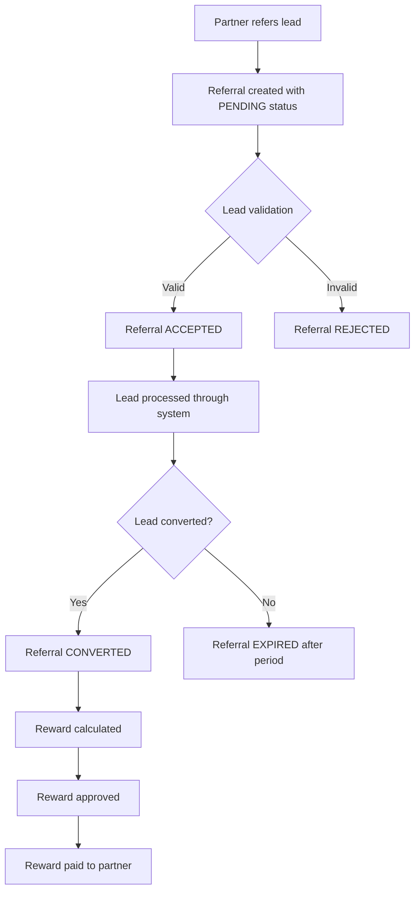
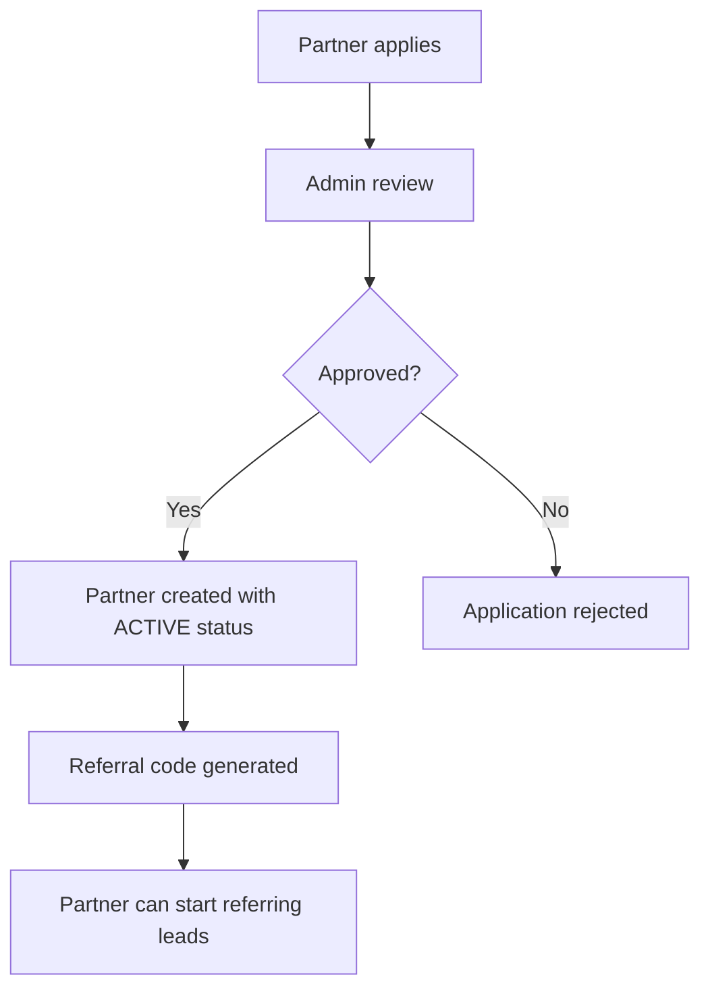

# Phase 9.3: Referral Program - Partner-driven Growth

## 🎯 Overview

This phase implements a comprehensive referral program to enable partner-driven growth for the Insurance Lead Generation AI Platform. The referral program allows partners (agents, affiliates, and external partners) to refer leads to the system and earn rewards for successful conversions.

## 📋 Objectives

1. **Partner Management**: Enable registration and management of referral partners
2. **Referral Tracking**: Track referred leads through the entire lifecycle
3. **Reward System**: Calculate and manage rewards for successful referrals
4. **Performance Analytics**: Provide insights into referral program effectiveness
5. **Integration**: Seamless integration with existing lead processing pipeline

## 🔧 Architecture

### New Database Models

#### 1. Partner Model
```prisma
model Partner {
  id              String     @id @default(uuid())
  userId          String?    // Link to existing user if applicable
  firstName       String
  lastName        String
  email           String     @unique
  phone           String
  companyName     String?
  referralCode    String     @unique
  status          PartnerStatus @default(ACTIVE)
  commissionRate  Float      @default(0.1) // 10% default commission
  totalReferrals  Int        @default(0)
  successfulReferrals Int     @default(0)
  totalEarnings    Float      @default(0.0)
  createdAt       DateTime   @default(now())
  updatedAt       DateTime   @updatedAt
  
  // Relationships
  referrals       Referral[]
  rewards         Reward[]
}
```

#### 2. Referral Model
```prisma
model Referral {
  id              String     @id @default(uuid())
  partnerId       String
  leadId          String?    // Linked when lead is created
  referralCode    String
  source          ReferralSource
  status          ReferralStatus @default(PENDING)
  referredAt      DateTime   @default(now())
  acceptedAt      DateTime?
  rejectedAt      DateTime?
  convertedAt     DateTime?
  conversionValue Float?     // Value of converted lead
  notes           String?
  
  // Relationships
  partner         Partner    @relation(fields: [partnerId], references: [id])
  lead            Lead?      @relation(fields: [leadId], references: [id])
  reward          Reward?
}
```

#### 3. Reward Model
```prisma
model Reward {
  id              String     @id @default(uuid())
  partnerId       String
  referralId      String
  amount          Float
  currency        String     @default("USD")
  status          RewardStatus @default(PENDING)
  calculatedAt    DateTime   @default(now())
  paidAt          DateTime?
  paymentMethod   String?
  transactionId   String?
  notes           String?
  
  // Relationships
  partner         Partner    @relation(fields: [partnerId], references: [id])
  referral        Referral   @relation(fields: [referralId], references: [id])
}
```

#### 4. New Enums
```prisma
enum PartnerStatus {
  ACTIVE
  INACTIVE
  SUSPENDED
  TERMINATED
}

enum ReferralSource {
  WEBSITE
  MOBILE_APP
  EMAIL
  PHONE
  IN_PERSON
  SOCIAL_MEDIA
  OTHER
}

enum ReferralStatus {
  PENDING
  ACCEPTED
  REJECTED
  CONVERTED
  PAID
  EXPIRED
}

enum RewardStatus {
  PENDING
  CALCULATED
  APPROVED
  PAID
  CANCELLED
}
```

## 🛠️ Implementation Components

### 1. Database Schema Updates
- Add Partner, Referral, and Reward models to Prisma schema
- Add necessary indexes for performance
- Create database migrations

### 2. TypeScript Types
- Partner, Referral, and Reward interfaces
- DTOs for creation and updates
- Filter and query parameters

### 3. Repository Layer
- `PartnerRepository`: CRUD operations for partners
- `ReferralRepository`: CRUD operations for referrals
- `RewardRepository`: CRUD operations for rewards

### 4. Service Layer
- `PartnerService`: Business logic for partner management
- `ReferralService`: Business logic for referral processing
- `RewardService`: Business logic for reward calculation and payout
- `ReferralAnalyticsService`: Analytics and reporting

### 5. API Routes
- Partner management endpoints
- Referral creation and tracking endpoints
- Reward management endpoints
- Analytics and reporting endpoints

### 6. Integration Points
- Lead creation: Check for referral codes and create referral records
- Lead conversion: Trigger reward calculation for successful referrals
- Agent assignment: Consider referral source in routing decisions

## 🎯 Key Features

### Partner Management
- Partner registration and onboarding
- Partner profile management
- Partner status management (active/inactive/suspended)
- Commission rate configuration
- Performance tracking

### Referral Processing
- Referral code generation and validation
- Referral creation from various sources
- Referral status tracking
- Lead linking and conversion tracking
- Referral expiration handling

### Reward System
- Automatic reward calculation on lead conversion
- Commission rate application
- Reward status management
- Payout processing
- Reward history and tracking

### Analytics & Reporting
- Referral performance metrics
- Partner performance dashboards
- Conversion rates by referral source
- Revenue attribution
- ROI calculation

### Integration
- Webhook for referral creation
- API for partner portal integration
- Email notifications for referral status changes
- Real-time updates for partners

## 📊 Success Metrics

### Program Metrics
- **Referral Volume**: Number of referrals per period
- **Conversion Rate**: Percentage of referrals that convert to leads
- **Partner Engagement**: Number of active referring partners
- **Revenue Growth**: Revenue attributed to referral program
- **Cost Efficiency**: Cost per acquired lead through referrals

### Partner Metrics
- **Referrals per Partner**: Average referrals per active partner
- **Conversion Rate per Partner**: Partner-specific conversion rates
- **Earnings per Partner**: Average earnings per partner
- **Partner Retention**: Partner churn rate

### Financial Metrics
- **ROI**: Return on investment for referral program
- **Customer Acquisition Cost (CAC)**: Cost per acquired customer
- **Lifetime Value (LTV)**: Lifetime value of referred customers
- **Payout Accuracy**: Accuracy of reward calculations

## 🔄 Workflow

### Referral Lifecycle


### Partner Onboarding


## 🧪 Testing Strategy

### Unit Tests
- Repository method tests
- Service business logic tests
- Utility function tests

### Integration Tests
- API endpoint tests
- Database interaction tests
- Service integration tests

### End-to-End Tests
- Full referral lifecycle tests
- Partner onboarding tests
- Reward calculation tests
- Error handling tests

### Performance Tests
- High-volume referral processing
- Concurrent partner operations
- Database query optimization

## 📅 Implementation Timeline

### Week 1: Foundation
- Database schema design and implementation
- TypeScript types and interfaces
- Basic repository implementations
- Core service logic

### Week 2: Core Features
- Partner management API
- Referral processing API
- Basic reward system
- Integration with lead pipeline

### Week 3: Advanced Features
- Analytics and reporting
- Notification system
- Partner portal integration
- Admin dashboard features

### Week 4: Testing & Optimization
- Comprehensive testing
- Performance optimization
- Security review
- Documentation

## 🎓 Acceptance Criteria

- [ ] Partner can register and get unique referral code
- [ ] Referrals can be created via API and webhook
- [ ] Referral status updates automatically as lead progresses
- [ ] Rewards are calculated correctly on lead conversion
- [ ] Partners can view their referral history and earnings
- [ ] Admin can manage partners and view program analytics
- [ ] System handles 1000+ referrals/day with <500ms response time
- [ ] All API endpoints have proper authentication and authorization
- [ ] Comprehensive test coverage (>80%)
- [ ] Documentation for API and integration

## 🔒 Security Considerations

- **Authentication**: JWT-based authentication for all API endpoints
- **Authorization**: Role-based access control (partner, admin, system)
- **Data Validation**: Comprehensive input validation
- **Rate Limiting**: Protect against abuse
- **Audit Logging**: Track all referral-related actions
- **Data Privacy**: GDPR/CCPA compliance for partner data

## 🚀 Deployment Strategy

- Feature flag for gradual rollout
- A/B testing for referral incentives
- Monitoring and alerting for referral processing
- Backup and restore procedures for referral data
- Performance monitoring and scaling

This implementation will create a robust referral program that drives partner-driven growth while maintaining integration with the existing lead generation platform.